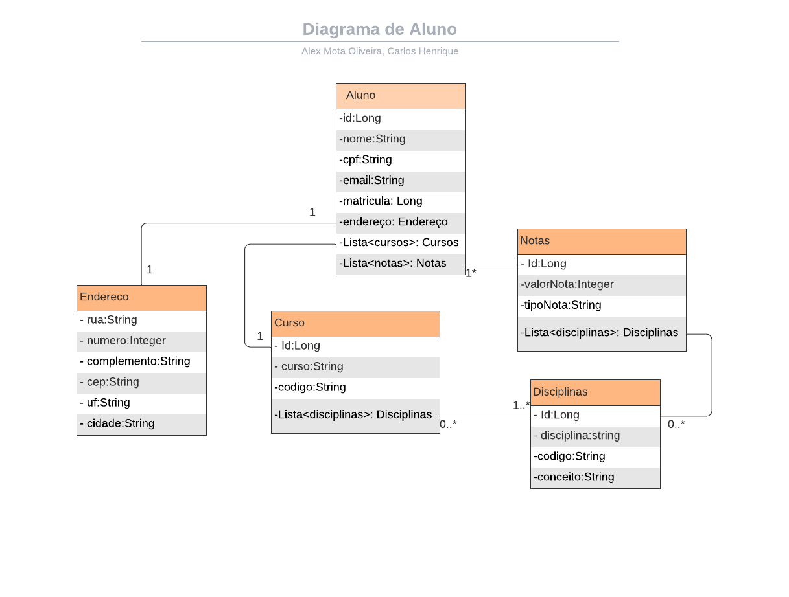

# Super API Node
*Sistema de "RP" de escolas*

## Projeto NODE - Entrega em Grupo
### Projeto de conclusão de Curso - Parte NODE
* * * *

*Enunciado: Os grupos deverão desenvolver um sistema que permita o Cadastro, Inclusão, Consulta e Exclusão de Alunos.*
* * * *

### Tecnologias utilizadas:
* JavaScript
* Node
* MongoDB
* Hapi
* Fetch
* Postman
* VisualStudio
* Liveshare
* Ngrok

* * * *
### Modelo Conceitual:

* * * *
### Utilização do Projeto:
* Faça download do projeto:
    * `git clone https://github.com/AlexMotaOliveira/api`
* Importe na sua IDE
* Inicie a aplicação.
	* `node server.js`
* * * *

### Links úteis após o inicio da API:

* Teste no Postman: https://www.getpostman.com/collections/c1892bbcf3f9a7f2aed5
* API de integração em JAVA: https://github.com/AlexMotaOliveira/gama-projeto-java
